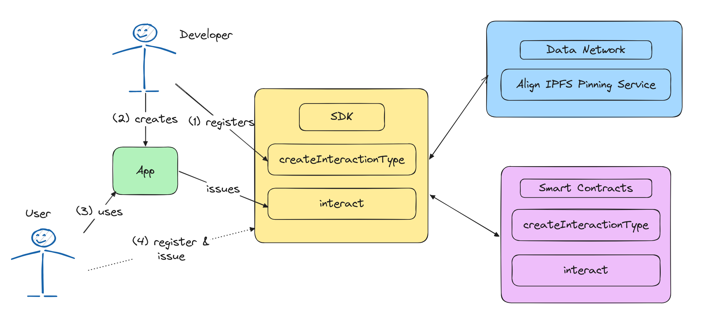

# Technical Specifications of Align

### Jump to:

- [Smart Contracts Repo]()
- [typescript SDK Repo]()
- [Example Apps Repo]()
- [AVS node reference implementation]()

### Introduction

Align encompasses the [Align Data Network](#network) and [Smart Contracts](#contracts). Align aims to address the inefficiencies of current centralized and decentralized social networks, (1) opinionated social interactions at the protocol level and (2) ensuring data is organized, indexable and available.

Align is a [Programmable Social Network](https://glu.wtf/blog/programmable-social-network) that provides a social interaction agnostic protocol layer allowing maximum programmability, increasing social composability and future proofing the protocol. This is done via a thin protocol layer that consists of a registry contract to store different interaction types, an identity registry to for easy identity management and a Proof of Staked backed decentralized storage solution.

Ecosystem:

- Protocol: Concerned with **organized**, **indexable** and **available** data
- Developers: Concerned with **creating** and **stacking** Interaction Types
- Users: Interacting with Clients (liking, commenting, airdrop hunting, attending events etc.)
- Anyone: disputing interactions

### How to Use

<div align="center">



</div>
<div align="center">
<p>
<i id="title">Sample Interaction Flow</i>
</p>
</div>

1. Developers Registers `InteractionTypes` to define a new social interaction. A social interaction could be a social media post, a like on that post but also awarding an SBT (soul bound token), or issuing verified credentials. Interactions can be fungible, and either private or public. Private types are only to be used by the creator, while public types can be used by anyone. This public type allows for composability as interactions types can reference others.
2. Developer creates an App ([example app repo]()) that issues interactions based on user inputs.
3. Users use app.
4. Users can issue their own interactions by creating a type, this would be akin to a personal blog.

### Data Model

The core data model the protocol uses is a hash of an interaction creators identity and a name for their new social interaction. This could be: `hash(<Align_Id>,"Post")`. Along with this identifier, a link parameter is provided to describe the interaction criteria, stored on IPFS, see an example below.

```js
// Stack 1: Points
{
  "summary": "Issuers must have the below contents defined for each interaction to be correctly recorded.",
  "contents": {
    "to": "<recipient of points address>",
    "amount": "<numeric amount of points>",
    "reason": "<reason the points were given>"
  }
}


// Stack 2: Project Specific Points

{
  ...points
  "pudgyholder": "true",
  "passedKYC": "true"
}
```

### Network

The network itself does not care about the context of these interactions but instead focuses on organizing, indexing and maxing available this data.

#### Decentralized Pinning Service

Data on the network is [pinned](https://docs.ipfs.tech/how-to/pin-files/) or saved on a decentralized network of nodes secured by Ethereum&apos;s proof of stake mechanism. This allows the network to grow unencumbered by the breath or depth of Client interactions. For example, the interaction could be a simple 'like' or more complex such as an ZK Proof. More details and a reference implementation will be made available for node operators.

### Contracts

#### AlignIdRegistry

[Link]()

A simple identity contract that allows anyone to register an address and receive an Align Identification number. This number is used to identify Developers on the network.

#### InteractionStation

[Link]()

`function createInteractionType`

Purpose: This function is used to create a new type of interaction. Each interaction type can be either fungible or non-fungible and may be restricted to creation by the original issuer only.

Parameters:

- bool fungible: Indicates whether the interaction type is fungible.
- bool onlyCreator: If set to true, only the creator can create further interactions of this type.
- string name: The reference name for the interaction type.
- string link: A link to additional information, typically an IPFS CID.
- bytes32[] referenceKeys: An array of keys that reference other related interaction types.

`function interact`

Purpose: Allows an issuer to create an interaction under an existing interaction type for a specified user.

Parameters:

- uint256 toAlignId: The ID of the user for whom the interaction is being created.
- bytes32 interactionTypeKey: The key identifying the interaction type.
- string interaction: The data for the interaction, typically an IPFS CID.

`dispute`

Purpose: Allows users to dispute an existing interaction, marking it as contested.

Parameters:

- bytes32 disputedInteractionKey: The key of the interaction being disputed.
- bytes32 disputeInteraction: The key of the interaction used as the basis for the dispute.
